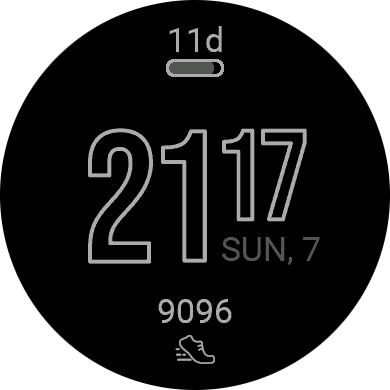

# Monoline

A simple and battery friendly watchface for your Garmin watch.

## Contributing

Pull requests and feature requests are welcome!

1. Setup the [Connect IQ SDK](https://developer.garmin.com/connect-iq/sdk/)
2. Setup Visual Studio Code, install the "Monkey C" and "Prettier Monkey C" extension.
3. Start coding and open a PR

## Notes

[Bebas Neue](https://fonts.google.com/specimen/Bebas+Neue/about), licensed under the [Open Font License](https://openfontlicense.org/), is used as a font.